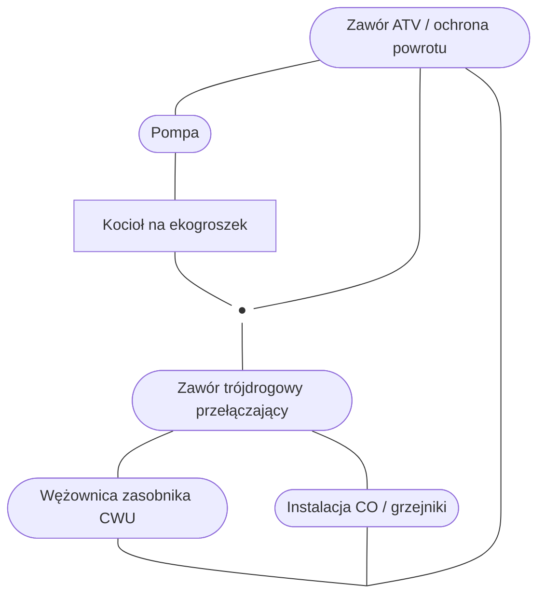

# Mała instalacja z jedną pompą

```mermaid
flowchart TD

%% Kocioł 
ATV([Zawór ATV / ochrona powrotu]) --- P([Pompa]) --- K[Kocioł na ekogroszek] --- R1((●)) --- V3([Zawór trójdrogowy przełączający]) --- CWU([Wężownica zasobnika CWU]) --- R2

R1 --- ATV


%% GAŁĄŹ CWU

%% GAŁĄŹ CO
V3 --- CO([Instalacja CO / grzejniki]) --- R2

R2 --- ATV

classDef wezly fill:transparent,stroke:transparent,stroke-width:1px;

class R1 wezly

classDef point fill:none,stroke:none,width:0px,height:0px,color:#00000000;

class R2 point

```
<!-- Skrypt dopasowujący strukturę HTML wygenerowaną przez GitHub Pages (Jekyll) do wymogów biblioteki Mermaid -->

